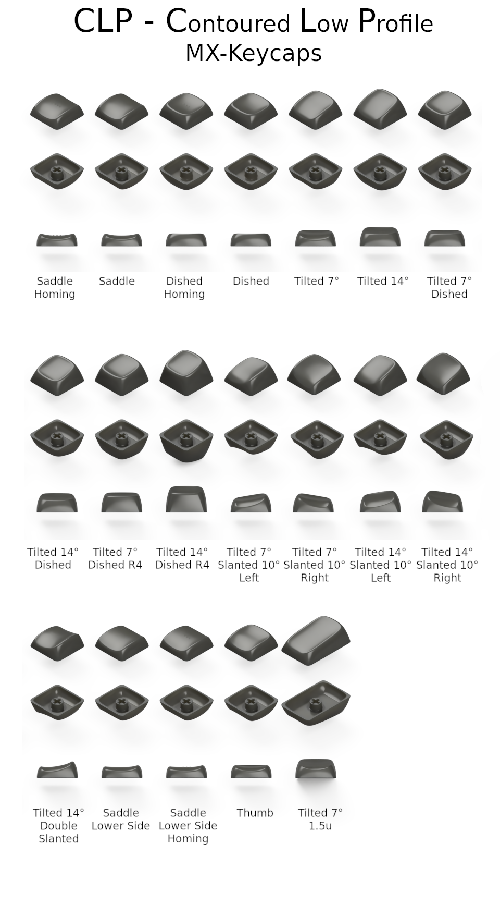
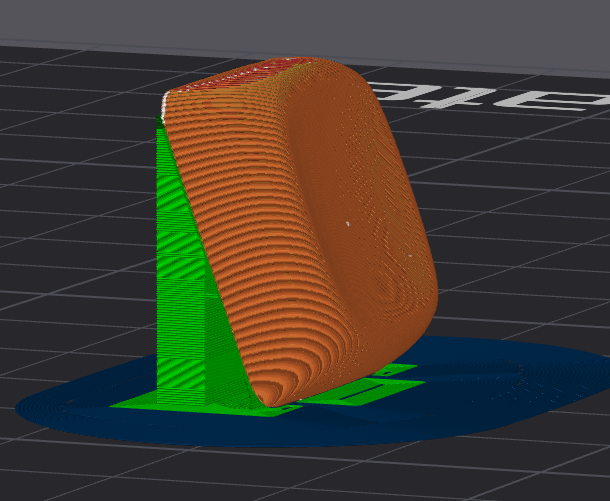
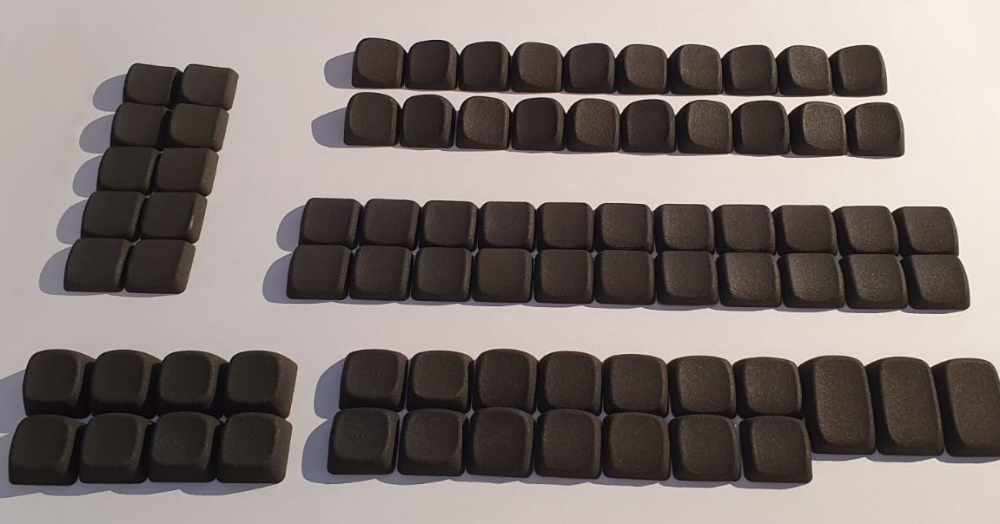
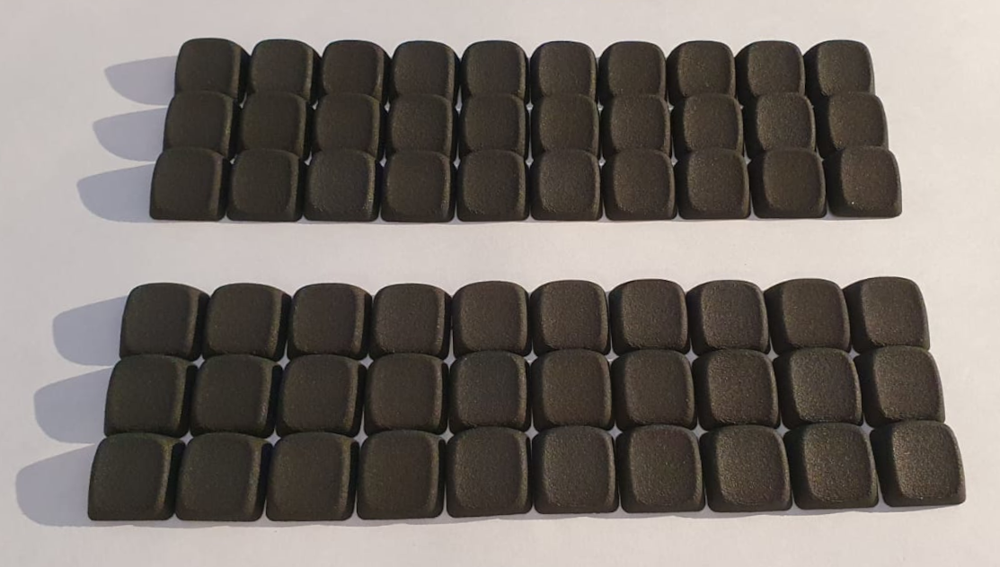
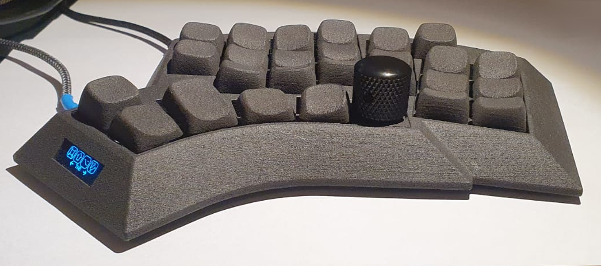
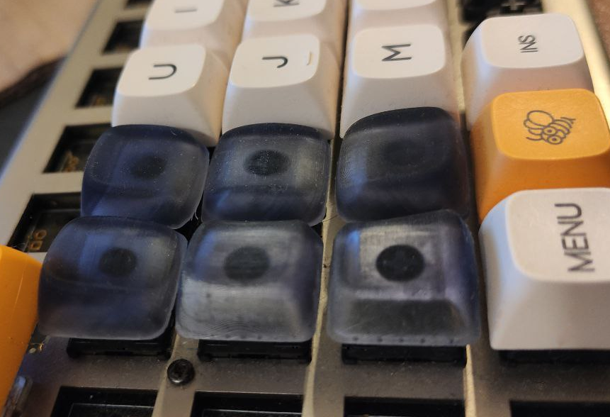
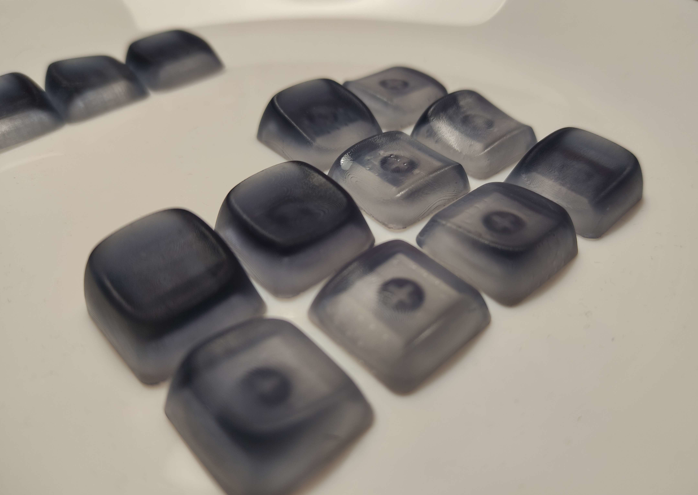
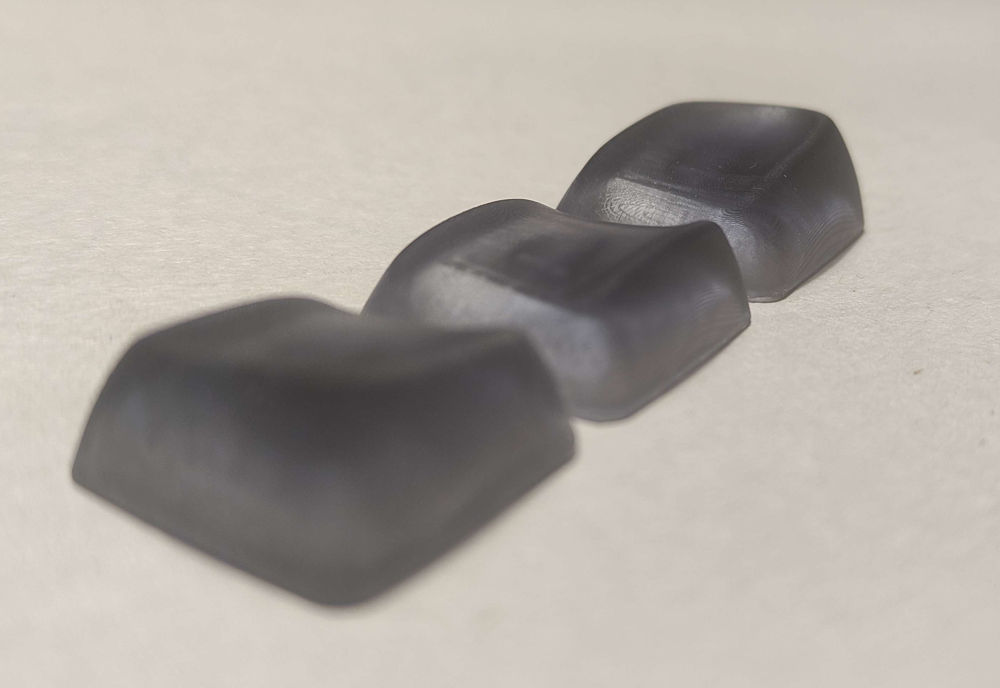

# CLP Contoured Low Profile MX Keycaps

The repository contains these folders:

- **fusion360** – source files for [Autodesk Fusion 360](https://www.autodesk.com/products/fusion-360/overview).
- **fusion360/assemblies** – Combined source files of a maximum of 10 keycaps. These files are used to export the models to STL files. Combining models into one file is a good way to save money on printing as printing services often charge a minimum price per model.
- **stl** – 3D models for any CAD or Slicer software.
- **stl/assemblies** – Combined files that you can use in any 3D-printing service like [JLCPCB](https://3d.jlcpcb.com/3d-printing/stereolithography) or [PCBWay](https://www.pcbway.com/rapid-prototyping/3d-printing/). Combining models into one file is a good way to save money on printing as printing services often charge a minimum price per model. If you need other combinations, you can use the source files in the `fusion360/assemblies` folder to create your own STL files.
- **assets** – folder that contains images and actual photos of keycaps.

There are currently 19 different keycap models available:

- **Saddle Homing**. A saddle-shaped keycap, similar to the Chicago Steno keycaps, with three little bumps, commonly used for home row index fingers.
- **Saddle**. A saddle-shaped keycap, similar to the Chicago Steno keycaps.
- **Dished Homing**. A normal dished keycap with three little bumps, commonly used for home row index fingers.
- **Dished**. A normal dished keycap.
- **Tilted 7°**. Same as **Dished**, but top profile has a 7° tilt and the front is lowered.
- **Tilted 14°**. Same as **Dished**, but top profile has a 14° tilt and the front is lowered.
- **Tilted 7° Dished**. Same as **Tilted 7°**, but the top profile is dished.
- **Tilted 14° Dished**. Same as **Tilted 14°**, but the top profile is dished.
- **Tilted 7° Dished R4**. Same as **Tilted 7° Dished**, but higher profile for the top row.
- **Tilted 14° Dished R4**. Same as **Tilted 14° Dished**, but higher profile for the top row.
- **Tilted 7° Slanted 10°**. Same as **Tilted 7°**, but the top profile is slanted 10° to the left/right (two variants).
- **Tilted 14° Slanted 10°**. Same as **Tilted 14°**, but the top profile is slanted 10° to the left/right (two variants).
- **Tilted 14° Double Slanted**. Same as **Tilted 14°**, but the top profile is slanted to both sides, intended to go between two tilted keycaps.
- **Saddle Lower Side**. Same as **Saddle**, but one side is lowered to have a better transition to the **Double Slanted** keycap.
- **Saddle Lower Side Homing**. Same as **Saddle Homing**, but one side is lowered to have a better transition to the **Double Slanted** keycap.
- **Thumb**. Same as **Dished**, but with a lowered front side.
- **Tilted 7° 1.5u**. Same as **Tilted 7°**, but 1.5u size.

## How to print?

- For the best results, use a resin printer with a high resolution, or an online printing service like [JLCPCB](https://3d.jlcpcb.com/3d-printing/stereolithography) or [PCBWay](https://www.pcbway.com/rapid-prototyping/3d-printing/). JLCPCB SLS Nylon seems to work well too. MJF Nylon should probably work, but is untested and slightly more expensive.
- If you want to print the keycaps yourself, you can use the STL files in the `stl` folder. If you want to print multiple keycaps at once, you can use the STL files in the `stl/assemblies` folder. These files are already combined and ready to print.
- Some tips for FDM printing (thanks to [u/justapcgamer](https://www.reddit.com/user/justapcgamer/)):
  - use a 0.2mm nozzle, both surface feel and the dimensional accuracy of the keycap stem is so much better
  - if you cannot, use the finest layer height you are comfortable with, but 0.4mm nozzle prints generally require a good bit of post processing like trimming the insides of the stem
  - use as low of a layer height as you can
  - print on bottom edge of one of the sides at an angle between 60-80 degrees, depending on which slice has a surface quality you like. 80 will result in a better surface but overhangs are rough. This image is 70 degrees: 
  - do not use supports for the inside of the stem, mark it for no supports in the slicer
  - use supports for the top edge so the underside doesn't sag and interfere with the switch
  - print in batches, if printing single keycap, increase the cooling. Since its small, if you print multiple, there's adequate time for cooling which results in better surfaces
  - if your printers toolhead has better cooling on one side, make sure the keycaps surface (side that touches your finger) faces the better cooled side for a better finish.
  - matte filaments will feel a bit rough, silk pla will feel slippery, I find normal pla gives the best finish.

## Images

SLS Nylon keycaps:

so how low profile are these keycaps?

source: [u/braindefender](https://www.reddit.com/user/braindefender/)

freshly hatched keycaps:

source: [u/braindefender](https://www.reddit.com/user/braindefender/)

source: [u/braindefender](https://www.reddit.com/user/braindefender/)

## Acknowledgements

As always this project wouldn't be possible without standing on the shoulders of giants. I took a lot of inspiration from braindefender's [KLP Lame keycaps](https://github.com/braindefender/KLP-Lame-Keycaps/). And sure enough, he was so kind to also provide excellent feedback (he alsocaught some nasty errors I overlooked!) and a bunch of tips and ideas. His experience with 3D printing keycaps was invaluable. He also did (well, still doing actually) a lot of test prints to check if the models are printable and work as expected. Thanks a lot, this would not have been possible without you, at least not at this level of quality and diversity!

Another source of inspiration was [Pseudoku's Distorted Ellipsoidal Saddle (DES) and Chicago Stenographer](https://github.com/toniz4/PseudoMakeMeKeyCapProfiles).

## License

All models are licensed under the GNU GPL v3 license. See the [LICENSE](./LICENSE) file for details.
